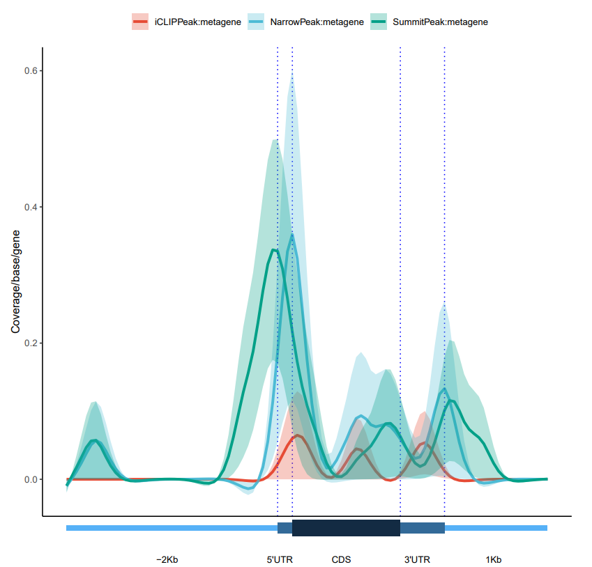
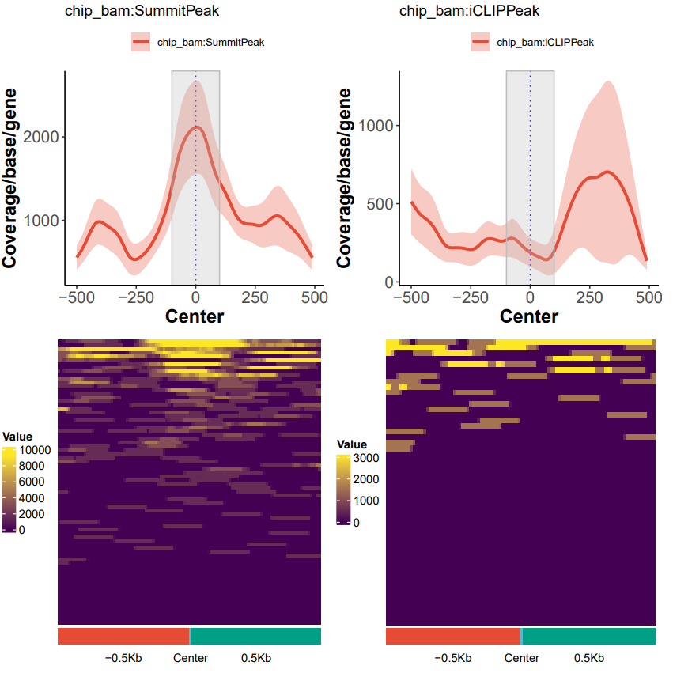
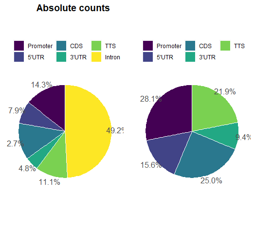

# GenomicPlot

<!-- badges: start -->
<!-- badges: end -->

The goal of GenomicPlot is to provide an efficient visualization tool for next generation sequencing (NGS) data with rich functionality and flexibility. GenomicPlot enables plotting of NGS data in various formats (bam, bed, wig and bigwig); both coverage and enrichment over input can be computed and displayed with respect to genomic features (such as UTR, CDS, enhancer), and user defined genomic loci or regions. Statistical tests on signal intensity within user defined regions of interest can be performed and presented as box plots or pie charts. Parallel processing is enabled to speed up computation on multi-core platforms. In addition to genomic plots which is suitable for displaying of coverage of genomic DNA (such as ChIP-seq data), metagenomic (without introns) plots can also be made for RNA-seq or CLIP-seq data as well. For peak annotation, peaks targeting exonic and intronic regions of genomic features (5'UTR, CDS, 3'UTR) are counted separately.

## Installation

The following packages are prerequisites: 

GenomicRanges (>= 1.46.1), GenomicFeatures, Rsamtools, ggplot2 (>= 3.3.5), tidyr, rtracklayer (>= 1.54.0), plyranges (>= 1.14.0), dplyr (>= 1.0.8), cowplot (>= 1.1.1), VennDiagram, ggplotify, GenomeInfoDb, IRanges, ComplexHeatmap, RCAS (>= 1.20.0), scales (>= 1.2.0), GenomicAlignments (>= 1.30.0), edgeR, forcats, circlize, viridis, ggsignif (>= 0.6.3), ggsci (>= 2.9), genomation (>= 1.26.0), ggpubr

You can install the development version of GenomicPlot from Bioconductor:

``` r
if (!require("BiocManager", quietly = TRUE))
    install.packages("BiocManager")
BiocManager::install("GenomicPlot", version = "devel")
```
or from [GitHub](https://github.com/shuye2009/GenomicPlot) with:

``` r
if (!require("remotes", quietly = TRUE))
   install.packages("remotes")
remotes::install_github("shuye2009/GenomicPlot", build_manual = TRUE, build_vignettes = TRUE)
```
or download the source package from the latest release on [GitHub](https://github.com/shuye2009/GenomicPlot) and run in R:

``` r
install.packages("path-to-source-package/GenomicPlot_x.x.x.tar.gz", repos = NULL)
```
where "path-to-source-package" is the absolute path to the file "GenomicPlot_x.x.x.tar.gz", substitute 'x' with the version number of your downloaded package.

## Examples

The following is a basic example which shows you how to visualize ChIP-seq peaks and iCLIP-seq peaks in different parts of genes.

``` r

library(GenomicPlot)

txdb <- AnnotationDbi::loadDb(system.file("extdata", "txdb.sql", 
    package = "GenomicPlot"))

data(gf5_meta)

queryfiles <- c(system.file("extdata", "test_chip_peak_chr19.narrowPeak",
                package = "GenomicPlot"),
                system.file("extdata", "test_chip_peak_chr19.bed", 
                package = "GenomicPlot"),
                system.file("extdata", "test_clip_peak_chr19.bed", 
                package = "GenomicPlot"))
names(queryfiles) <- c("NarrowPeak", "SummitPeak", "iCLIPPeak")

bedimportParams <- setImportParams(
  offset = 0, fix_width = 100, fix_point = "center", norm = FALSE,
  useScore = FALSE, outRle = TRUE, useSizeFactor = FALSE, genome = "hg19"
)

op <- "test_plot_5parts_metagene1"

plot_5parts_metagene(queryFiles = queryfiles, 
                     gFeatures = list(metaF = gf6_meta), 
                     inputFiles = NULL, 
                     importParams = bedimportParams,
                     verbose = FALSE, 
                     smooth = TRUE, 
                     scale = FALSE, 
                     stranded = TRUE, 
                     outPrefix = op, 
                     transform = NA, 
                     heatmap = TRUE,
                     rmOutlier = 0, 
                     heatRange = NULL,
                     nc = 4)
                     
```


The following example shows you how to visualize distance between iCLIP_peaks/ChIP-seq narrowPeaks and ChIP-seq summit Peaks.

``` r
centerfiles <- c(
  system.file("extdata", "test_clip_peak_chr19.bed", package = "GenomicPlot"),
  system.file("extdata", "test_chip_peak_chr19.bed", package = "GenomicPlot")
)
names(centerfiles) <- c("iCLIPPeak", "SummitPeak")
queryfiles <- c(
  system.file("extdata", "chip_treat_chr19.bam", package = "GenomicPlot")
)
names(queryfiles) <- c("chip_bam")
inputfiles <- c(
  system.file("extdata", "chip_input_chr19.bam", package = "GenomicPlot")
)
names(inputfiles) <- c("chip_input")
op <- "test_plot_locus2"

chipimportParams <- setImportParams(
  offset = 0, fix_width = 150, fix_point = "start", norm = TRUE, 
  saveRds = FALSE, useScore = FALSE, outRle = TRUE, useSizeFactor = FALSE, 
  genome = "hg19"
)

plot_locus(queryFiles = queryfiles, 
                     centerFiles = centerfiles, 
                     ext = c(-1000, 1000), 
                     hl = c(-100, 100), 
                     inputFiles = inputfiles,                              
                     importParams = chipimportParams, 
                     shade = TRUE, 
                     binSize = 10, 
                     refPoint = "center", 
                     Xlab = "Summit",
                     verbose = FALSE, 
                     smooth = TRUE, 
                     scale = FALSE, 
                     stranded = TRUE, 
                     outPrefix = op, 
                     transform = NA, 
                     heatmap = TRUE,
                     heatRange = NULL,
                     rmOutlier = 0, 
                     nc = 4)
                     
```


The following example shows you how to annotate ChIP-seq peaks. The annotation statistics is shown in "test_plot_peak_annotation.png". The detailed annotation is in the table "summitPeak_targeted_annotated_gene.tab".

``` r
gtffile <- system.file("extdata", "gencode.v19.annotation_chr19.gtf", 
                       package = "GenomicPlot")

centerfile <- system.file("extdata", "test_chip_peak_chr19.bed", 
                          package = "GenomicPlot")
names(centerfile) <- c("SummitPeak")

op <- "test_plot_peak_annotation1"

plot_peak_annotation(peakFile = centerfile, 
                     gtfFile = gtffile, 
                     importParams = bedimportParams, 
                     fiveP = -1000, 
                     threeP = 1000, 
                     outPrefix = op, 
                     verbose = TRUE)

```



